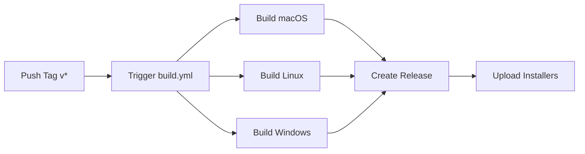

# GitHub Actions Workflows

This directory contains automated build workflows for the VLSM Calculator Tauri app.

## Workflows

### 1. `build.yml` - Release Build
**Trigger**: Push to tags matching `v*` or manual dispatch

Builds the app for all platforms and creates a GitHub release:
- **macOS**: Apple Silicon (M1/M2/M3) and Intel builds
- **Linux**: .deb and .AppImage
- **Windows**: .msi and .exe installers

**Usage**:
```bash
# Create and push a version tag
git tag v1.0.0
git push origin v1.0.0
```

The workflow will automatically:
1. Build for all platforms
2. Create a draft release
3. Upload all installers as release assets


### 2. `build-manual.yml` - Manual Build
**Trigger**: Manual dispatch only

Allows you to build for specific platforms without creating a release.

**Usage**:
1. Go to **Actions** tab in GitHub
2. Select **Manual Build** workflow
3. Click **Run workflow**
4. Choose platform: `all`, `macos`, `linux`, or `windows`
5. Download artifacts from the workflow run

**Artifacts**:
- `macos-builds/` - .dmg installers
- `linux-builds/` - .deb and .AppImage
- `windows-builds/` - .msi and .exe


## Output Files

### macOS
- `VLSM Calculator_0.1.0_aarch64.dmg` (Apple Silicon)
- `VLSM Calculator_0.1.0_x64.dmg` (Intel)

### Linux
- `vlsm-calculator_0.1.0_amd64.deb` (Debian/Ubuntu)
- `vlsm-calculator_0.1.0_amd64.AppImage` (Universal)

### Windows
- `VLSM Calculator_0.1.0_x64_en-US.msi` (Installer)
- `VLSM Calculator_0.1.0_x64-setup.exe` (Setup)


## Requirements

No setup required! The workflows automatically:
- Install Bun
- Install Rust
- Install system dependencies
- Build the app
- Package installers


## Local Building

To build locally for your current platform:
```bash
# Install dependencies
bun install

# Build the app
bun run tauri:build:clean
```

Output will be in `src-tauri/target/release/bundle/`


## Troubleshooting

### Build fails on Linux
Ensure system dependencies are installed:
```bash
sudo apt-get update
sudo apt-get install -y libwebkit2gtk-4.0-dev libwebkit2gtk-4.1-dev \
  libappindicator3-dev librsvg2-dev patchelf
```

### Build fails on macOS
Make sure Xcode Command Line Tools are installed:
```bash
xcode-select --install
```

### Build fails on Windows
Ensure Visual Studio Build Tools with C++ workload is installed.


## CI/CD Pipeline




## Notes

- Builds run in parallel for faster completion
- Draft releases allow review before publishing
- All builds are signed (configure signing in tauri.conf.json)
- Artifacts are kept for 90 days